# Retail Sales Analytics Dashboard using Excel Power Pivot & DAX

## 📊 Project Overview

The **Retail Sales Analytics Dashboard** is an interactive Business Intelligence project developed using **Microsoft Excel, Power Query, Power Pivot, DAX, PivotTables, PivotCharts, and Slicers**.

The purpose of this project is to transform raw retail transaction data into meaningful and actionable business insights using a structured **Star Schema Data Model**.

The dashboard provides a centralized view of:

* Revenue
* Profit
* Profit Margin
* Orders
* Revenue per Customer
* Brand Performance
* Category Performance
* Channel Performance
* Store Performance
* Geographic Performance
* Shipping Performance
* Monthly Revenue Trends

The interactive dashboard enables business users to explore different aspects of retail performance, identify trends, compare business segments, and support data-driven decision-making.

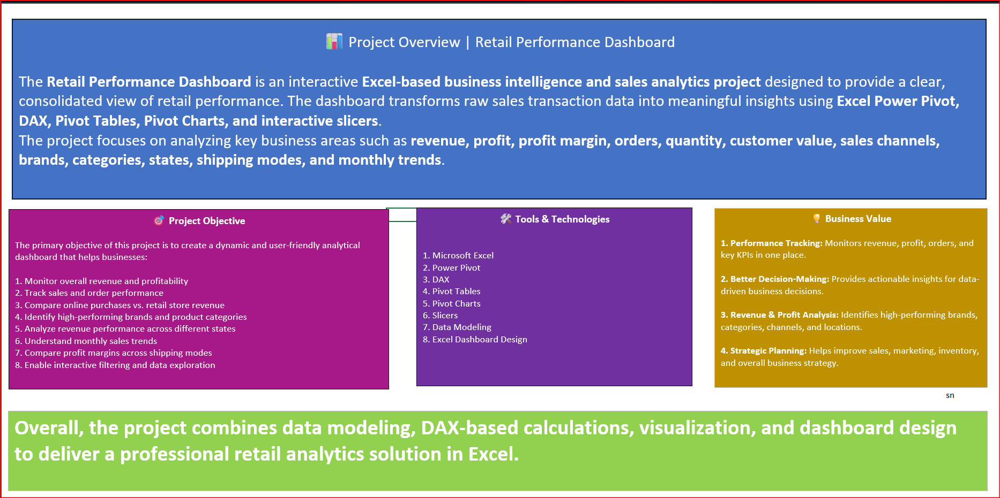

---

# 🎯 Business Problem

Retail businesses generate large amounts of transactional data from multiple customers, products, stores, locations, and sales channels.

Analyzing this information manually can be time-consuming and makes it difficult to identify important business trends.

This project was developed to solve these challenges by creating an interactive analytical reporting solution.

### Key Business Requirements

* Monitor overall sales performance.
* Track revenue and profitability.
* Measure profit margins.
* Analyze customer purchasing behavior.
* Compare sales channels.
* Identify high-performing brands.
* Identify top-performing stores and cities.
* Analyze category-level profitability.
* Evaluate shipping-mode performance.
* Track monthly revenue trends.
* Provide interactive filtering.
* Enable faster and more informed business decisions.

---

# 📁 Dataset Information

The project uses a retail sales dataset containing approximately:

* **20,000 Sales Transactions**
* **2,500 Customers**
* Multiple Product Brands
* Multiple Product Categories
* Multiple Store Locations
* Multiple Sales Channels

The dataset is divided into fact and dimension tables to create a structured analytical environment.

---

# 🗂️ Data Tables

## 1. Sales_Fact

The `Sales_Fact` table is the central **Fact Table** containing individual retail sales transactions.

### Key Fields

* `OrderID`
* `OrderDateKey`
* `CustomerID`
* `ProductID`
* `StoreID`
* `Quantity`
* `UnitPrice`
* `DiscountPct`
* `GrossSales`
* `NetRevenue`
* `COGS`
* `Profit`

The table provides the numerical data required for revenue, sales, order, quantity, and profitability analysis.

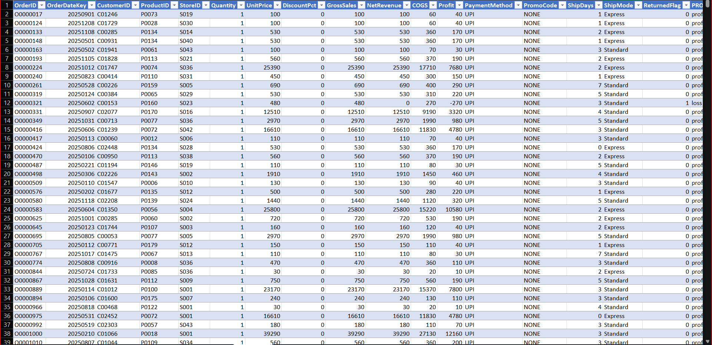

---

## 2. Customers

The `Customers` table contains customer-level information.

### Key Fields

* `CustomerID`
* `CustomerName`
* `Gender`
* `Age`
* `Segment`
* `City`
* `State`
* `PreferredChannel`
* `IsActive`

This table supports customer segmentation, customer behavior, and channel-preference analysis.

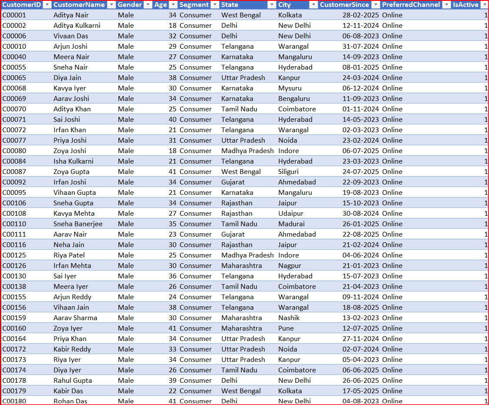

---

## 3. Products

The `Products` table contains information about products and their classifications.

### Key Fields

* `ProductID`
* `ProductName`
* `Brand`
* `Category`

This table enables analysis of revenue and profitability across products, brands, and categories.

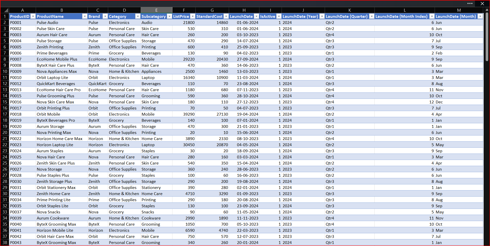

---

## 4. Stores

The `Stores` table contains information about stores and their sales channels.

### Key Fields

* `StoreID`
* `StoreName`
* `City`
* `Channel`

This table supports store-level, city-level, geographical, and channel analysis.

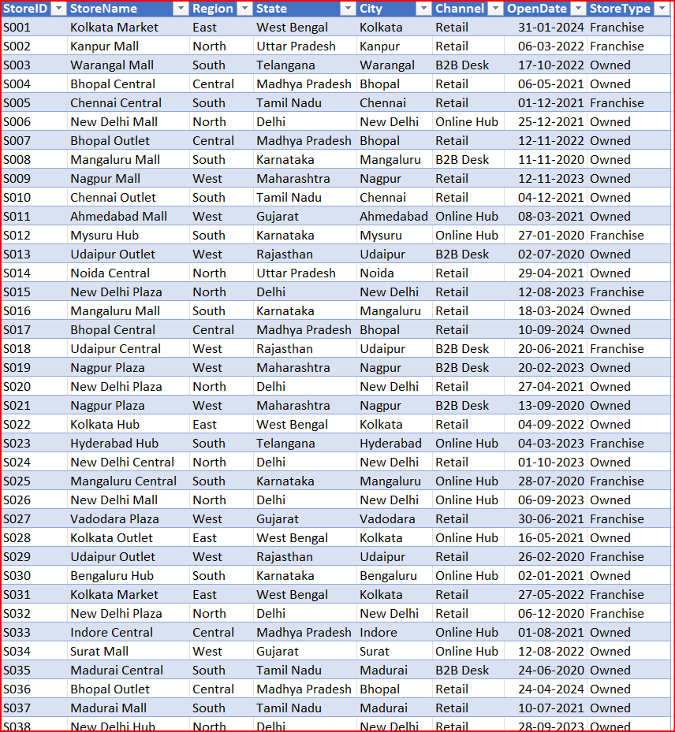

---

## 5. Date

The `Date` table is the dedicated **Date Dimension** used for time-based analysis.

### Key Fields

* `Date`
* `Month`
* `Quarter`
* `Year`

The Date table enables monthly, quarterly, and yearly analysis.

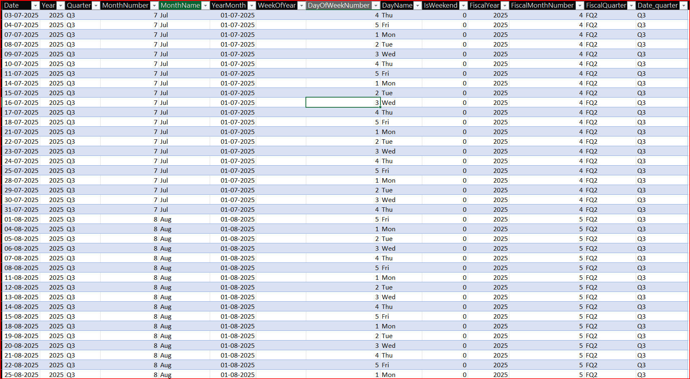

---

# 🔄 Power Query Data Preparation

**Power Query** was used to import, clean, transform, and prepare the raw data before loading it into the Power Pivot Data Model.

### Data Preparation Process

The following activities were performed:

* Imported the raw retail dataset.
* Reviewed the structure and quality of the data.
* Removed unnecessary columns and records.
* Checked for missing values.
* Checked for duplicate records.
* Corrected data types.
* Standardized categorical fields.
* Prepared date-related fields.
* Structured fact and dimension tables.
* Prepared analysis-ready datasets.
* Loaded the transformed tables into the Data Model.

### Power Query Workflow

```text
Raw Data
   ↓
Power Query
   ↓
Data Cleaning
   ↓
Data Transformation
   ↓
Data Validation
   ↓
Load to Data Model
```

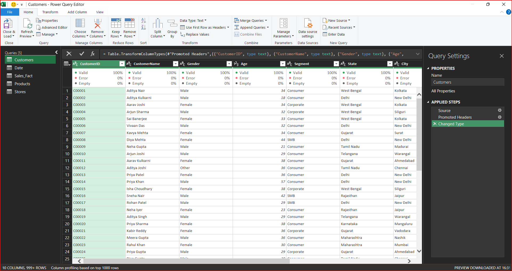

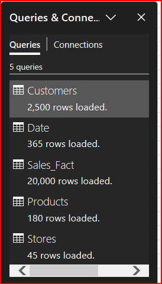

---

# ➕ Adding New Data

The dashboard workflow is designed to allow new sales data to be incorporated into the existing analytical model.

When new transactions become available, the data can be added to the source table while maintaining the same column structure.

### New Data Process

1. Add the new sales records to the source table.
2. Maintain the existing column structure.
3. Verify important fields such as `OrderID`, `OrderDateKey`, `CustomerID`, `ProductID`, `StoreID`, `Quantity`, `NetRevenue`, and `Profit`.
4. Refresh the Power Query connection.
5. Refresh the Power Pivot Data Model.
6. Refresh the PivotTables.
7. Refresh the PivotCharts.
8. Verify that the dashboard reflects the updated information.

   
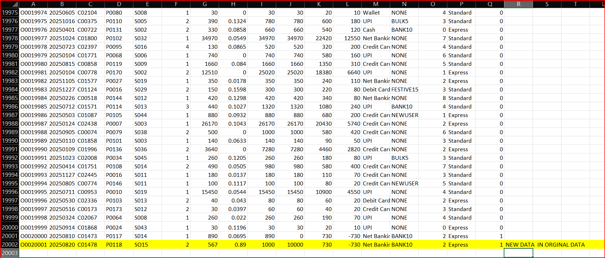

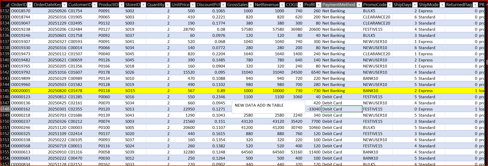

### Data Update Workflow

```text
New Sales Data
      ↓
Source Table
      ↓
Power Query Refresh
      ↓
Power Pivot Data Model
      ↓
DAX Measures
      ↓
PivotTables
      ↓
PivotCharts
      ↓
Dashboard
```

This makes the reporting solution easier to maintain and update as new transactions become available.

---

# ⭐ Data Model

A **Star Schema Data Model** was implemented using **Excel Power Pivot**.

### Fact Table

```text
Sales_Fact
```

### Dimension Tables

```text
Customers
Products
Stores
Date
```

### Model Structure

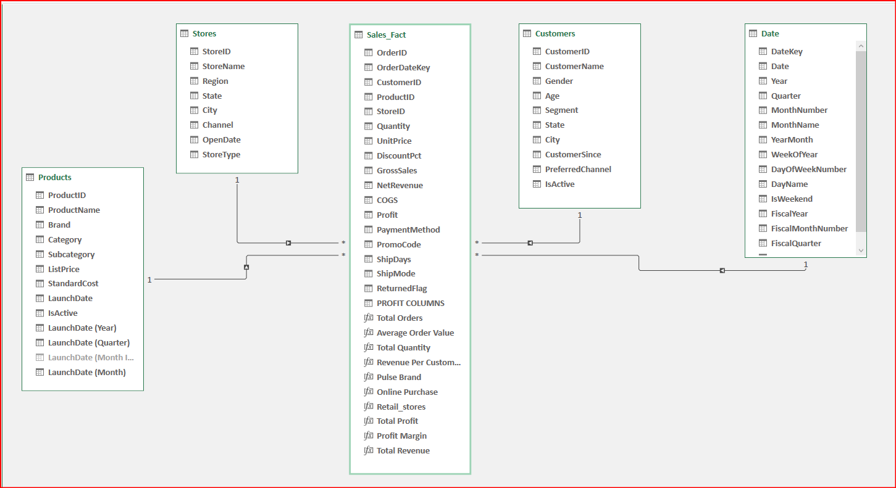

The `Sales_Fact` table acts as the central transaction table, while the dimension tables provide descriptive information used for filtering, grouping, and analysis.

### Benefits of the Star Schema

* Structured analytical architecture
* Efficient filtering
* Better DAX performance
* Reduced data duplication
* Improved scalability
* Easier maintenance
* Simplified reporting
* Multi-dimensional analysis

---

# 🧮 DAX Measures

**DAX (Data Analysis Expressions)** was used to create reusable analytical calculations and business KPIs.

## Revenue Measures

### Total Revenue

```DAX
Total Revenue =
SUM(Sales_Fact[NetRevenue])
```

Calculates the total revenue generated from sales transactions.

### Online Purchase Revenue

```DAX
Online Purchase =
CALCULATE(
    [Total Revenue],
    Customers[PreferredChannel]="Online"
)
```

Calculates revenue associated with customers whose preferred channel is Online.

### Retail Store Revenue

```DAX
Retail Stores Revenue =
CALCULATE(
    [Total Revenue],
    Stores[Channel]="Retail"
)
```

Calculates revenue generated through retail stores.

---

# 📦 Order Measures

## Total Orders

```DAX
Total Orders =
DISTINCTCOUNT(Sales_Fact[OrderID])
```

Calculates the number of unique orders.

## Average Order Value

```DAX
Average Order Value =
DIVIDE(
    [Total Revenue],
    [Total Orders]
)
```

Calculates the average revenue generated per order.

---

# 👥 Customer Measures

## Total Customers

```DAX
Total Customers =
DISTINCTCOUNT(Customers[CustomerID])
```

Calculates the number of unique customers.

## Revenue Per Customer

```DAX
Revenue Per Customer =
DIVIDE(
    [Total Revenue],
    [Total Customers]
)
```

Measures the average revenue contribution per customer.

---

# 💰 Profit Measures

## Total Profit

```DAX
Total Profit =
SUM(Sales_Fact[Profit])
```

Calculates the total profit generated from sales.

## Profit Margin

```DAX
Profit Margin =
DIVIDE(
    [Total Profit],
    [Total Revenue]
)
```

Calculates profit as a percentage of revenue.

---

# 🏷️ Brand Analysis

## Pulse Brand Revenue

```DAX
Pulse Brand Revenue =
CALCULATE(
    [Total Revenue],
    Products[Brand]="Pulse"
)
```

Calculates revenue generated specifically by the Pulse brand.

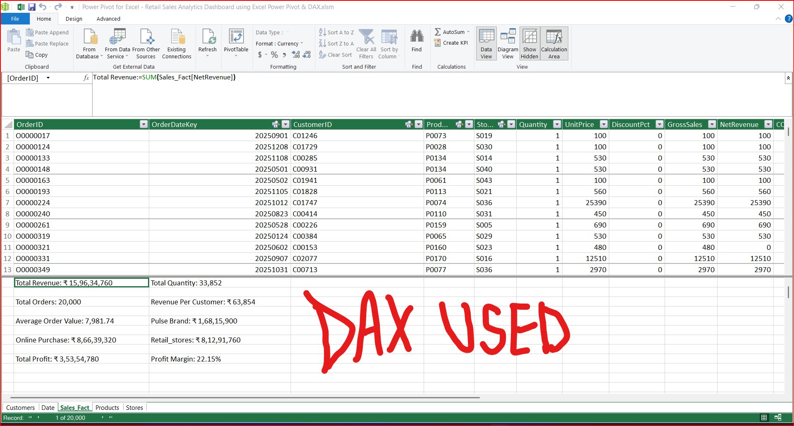

---

# 📊 PivotTables

**PivotTables** were used as the analytical layer between the Power Pivot Data Model and the final dashboard.

They summarize large amounts of transactional data and make it easier to analyze business performance across different dimensions.

### Major PivotTable Analyses

* Revenue by Brand
* Revenue by Channel
* Revenue by Store
* Revenue by City
* Profit by Category
* Profit Margin by Shipping Mode
* Monthly Revenue
* Customer Performance
* Order Performance

### PivotTable Workflow

```text
Power Pivot Data Model
          ↓
      DAX Measures
          ↓
       PivotTables
          ↓
      PivotCharts
          ↓
       Dashboard
```

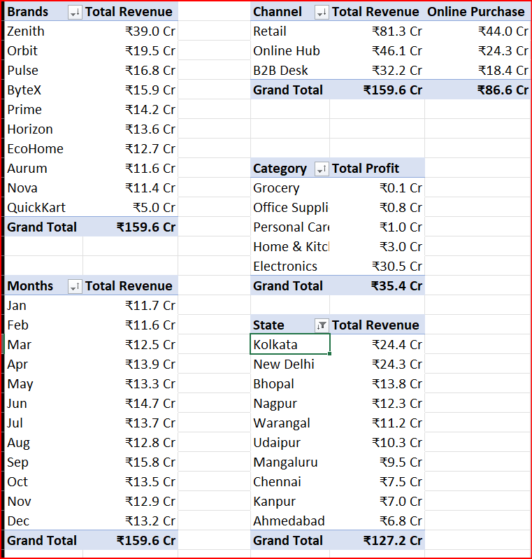


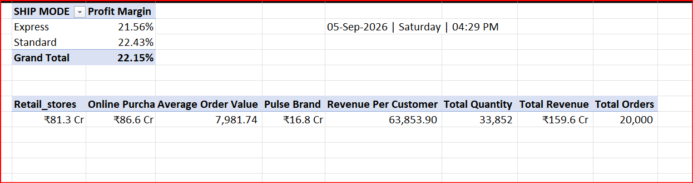

---

# 📌 Dashboard KPIs

The dashboard provides high-level KPIs for quick business performance monitoring.

| KPI                         | Business Purpose                               |
| --------------------------- | ---------------------------------------------- |
| **Total Revenue**           | Measures overall sales revenue                 |
| **Total Profit**            | Measures total business profitability          |
| **Profit Margin**           | Measures profitability relative to revenue     |
| **Total Orders**            | Measures order volume                          |
| **Revenue Per Customer**    | Measures average customer revenue contribution |
| **Online Purchase Revenue** | Measures online channel contribution           |
| **Retail Revenue**          | Measures retail channel contribution           |
| **Brand Revenue**           | Measures revenue generated by brands           |

These KPI cards provide management with a quick overview of the overall business performance.

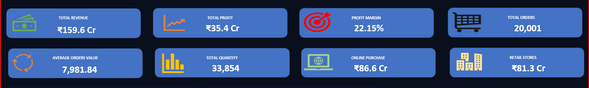

---

# 📈 Dashboard Visualizations

## 1. Revenue by Brands

The **Revenue by Brands** visualization compares revenue generated by individual brands.

It helps identify:

* Leading brands
* Revenue contribution
* Brand-level performance
* Growth opportunities

---

## 2. Channel-wise Revenue Analysis

This visualization compares revenue across different sales channels, including:

* Retail
* Online Hub
* B2B Desk

It helps understand the contribution of different channels and supports channel-specific strategies.

---

## 3. Top Performing Stores by City

This visualization identifies stores and cities contributing the highest revenue.

It helps analyze:

* Regional performance
* Store productivity
* High-performing markets
* Expansion opportunities

---

## 4. Profit by Category

The **Profit by Category** visualization compares profitability across product categories.

It helps identify:

* Most profitable categories
* Lower-performing categories
* Category contribution
* Product strategy opportunities

---

## 5. Profit Margin by Shipping Mode

This chart compares profit margins across different shipping methods.

It helps evaluate the relationship between shipping operations and business profitability.

---

## 6. Monthly Revenue Trend

The monthly revenue trend tracks revenue performance throughout the year.

It helps identify:

* Growth patterns
* Revenue fluctuations
* Seasonal trends
* High-performing periods
* Low-performing periods

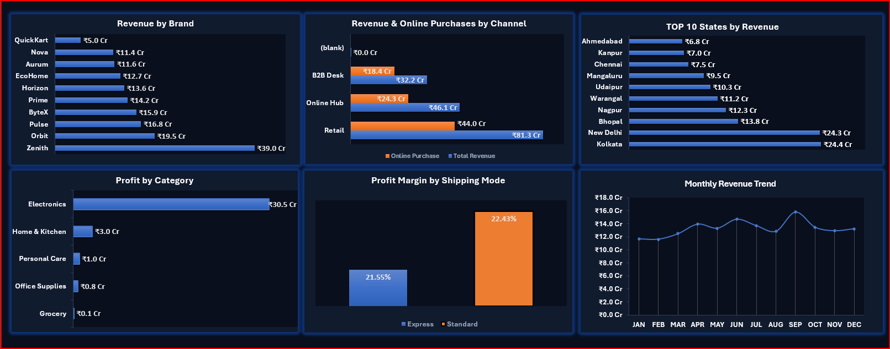

---

# 🎛️ Interactive Dashboard Features

The dashboard provides an interactive analytical experience using Excel Slicers.

## Slicers

Users can dynamically filter the dashboard using:

* **Channel**
* **Brand**
* **State**
* **Category**
* **Sub-category**

When a slicer selection is made, connected PivotTables, PivotCharts, and KPIs update according to the selected filters.

This allows users to perform both high-level and detailed analysis without manually modifying the underlying dataset.

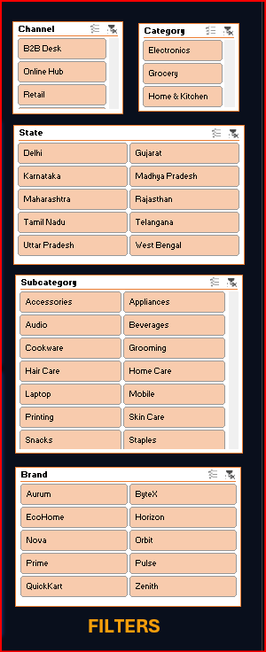

---

# 💡 Key Business Insights

The dashboard provides several important business insights:

* Approximately **20,000 transactions** are included in the analysis.
* The underlying dataset generated approximately **₹15.96 million in revenue**.
* Overall **profit margin is approximately 22.15%**.
* **Electronics** is one of the strongest profit-generating categories.
* The **Retail channel** contributes significant revenue.
* Revenue performance varies across different cities and stores.
* Certain locations contribute substantially more revenue than others.
* Monthly revenue shows fluctuations across different periods.
* Brand-level analysis helps identify high-performing brands.
* Channel and geographic analysis can support strategic sales planning.

---

# 🛠️ Tools & Technologies

The project was developed using:

* **Microsoft Excel**
* **Power Query** – Data import, cleaning, and transformation
* **Power Pivot** – Data modeling and relationship management
* **DAX** – Analytical calculations and KPIs
* **PivotTables** – Data summarization and analysis
* **PivotCharts** – Data visualization
* **Slicers** – Interactive filtering
* **Star Schema** – Analytical data architecture

---

# 🧠 Skills Demonstrated

This project demonstrates practical skills in:

* Data Cleaning
* Data Transformation
* Power Query
* Data Modeling
* Star Schema Design
* Power Pivot
* DAX Calculations
* KPI Development
* PivotTable Analysis
* PivotChart Development
* Business Intelligence
* Sales Analytics
* Customer Analysis
* Profitability Analysis
* Data Visualization
* Dashboard Design
* Interactive Reporting
* Business Insight Generation
* Excel Reporting

---

# 📊 Business Value

The dashboard provides business value in four major areas:

### 1. Performance Tracking

Provides a centralized view of revenue, profit, orders, and other important KPIs.

### 2. Better Decision-Making

Converts raw transactional data into actionable business insights.

### 3. Revenue & Profit Analysis

Helps identify high-performing brands, categories, channels, stores, and locations.

### 4. Strategic Planning

Supports sales planning, marketing decisions, inventory planning, channel strategy, and overall business growth.

---

# 📸 Dashboard Preview

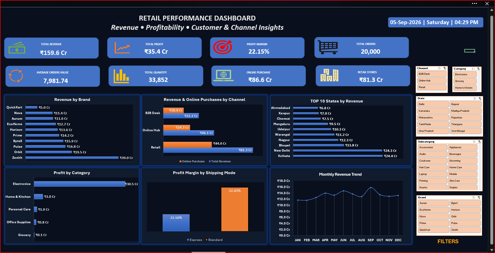

The final dashboard combines KPI cards, analytical charts, interactive slicers, and business performance indicators into a single reporting interface.

---

# 🎥 Demo Video

A project demonstration video can be added here:

```markdown
[▶ Watch Retail Sales Analytics Dashboard Demo](YOUR_VIDEO_LINK)
```

### Demo Covers

1. Project introduction
2. Dataset structure
3. Power Query data preparation
4. Power Pivot Data Model
5. DAX measures
6. PivotTables
7. KPI cards
8. Revenue analysis
9. Profit analysis
10. Brand analysis
11. Channel analysis
12. Store and city analysis
13. Monthly revenue trend
14. Interactive slicers
15. Business insights

---

# 📂 Workbook Structure

| Worksheet       | Purpose                                  |
| --------------- | ---------------------------------------- |
| **Customers**   | Customer information                     |
| **Products**    | Product, brand, and category information |
| **Stores**      | Store, city, and channel information     |
| **Sales_Fact**  | Central transaction/fact table           |
| **Date**        | Date dimension for time analysis         |
| **PIVOT Table** | Analytical PivotTables                   |
| **DASHBOARD**   | Final interactive dashboard              |

---

# ▶️ How to Use

### Step 1 — Open the Workbook

Open the Excel `.xlsm` workbook in Microsoft Excel.

### Step 2 — Enable Content

If Excel displays a security notification, enable the required content/macros.

### Step 3 — Open Dashboard

Navigate to the **DASHBOARD** worksheet.

### Step 4 — Review KPIs

Review the KPI cards to understand overall business performance.

### Step 5 — Explore Visualizations

Analyze revenue, profit, brands, categories, channels, stores, shipping modes, and monthly trends.

### Step 6 — Apply Slicers

Use the available slicers to filter the dashboard by:

* Channel
* Brand
* State
* Category
* Sub-category

### Step 7 — Refresh Data

When new data is added, refresh:

```text
Power Query
      ↓
Power Pivot
      ↓
PivotTables
      ↓
PivotCharts
      ↓
Dashboard
```

### Step 8 — Clear Filters

Clear the slicers to return to the overall business view.

---

# 🔄 Complete Project Workflow

The complete analytics workflow used in this project is:

```text
Raw Retail Data
       ↓
   Power Query
       ↓
Data Cleaning & Transformation
       ↓
   Power Pivot
       ↓
   Star Schema
       ↓
      DAX
       ↓
   PivotTables
       ↓
   PivotCharts
       ↓
     Slicers
       ↓
Interactive Dashboard
       ↓
 Business Insights
```

This workflow demonstrates the complete process of converting raw transactional data into an interactive Business Intelligence solution.

---

# 🚀 Future Improvements

The dashboard can be further enhanced with:

* Automated data refresh
* Sales forecasting
* Revenue prediction
* Customer segmentation
* Customer Lifetime Value analysis
* Product recommendations
* Return-rate analysis
* Inventory analytics
* Advanced geographic analysis
* Customer retention analysis
* AI-based business recommendations
* Automated management reporting

---

# 🏆 Project Outcome

The project successfully demonstrates how **Microsoft Excel can be used as a Business Intelligence platform** to transform raw retail transaction data into an interactive analytical solution.

By combining **Power Query, Power Pivot, Star Schema modeling, DAX, PivotTables, PivotCharts, and Slicers**, the project provides a complete workflow for data preparation, modeling, analysis, visualization, and business reporting.

The final dashboard enables users to monitor **sales, revenue, profit, customers, brands, categories, channels, stores, geography, shipping performance, and monthly trends** in a single interactive environment.

---

# ⭐ Project Summary

```text
Raw Data
   ↓
Power Query
   ↓
Data Cleaning & Transformation
   ↓
Power Pivot
   ↓
Star Schema
   ↓
DAX Measures
   ↓
PivotTables
   ↓
PivotCharts
   ↓
Slicers
   ↓
Interactive Dashboard
   ↓
Business Insights
```

> **From Raw Retail Data to Business Intelligence — using Excel Power Query, Power Pivot, DAX, PivotTables, and Interactive Dashboarding.**
